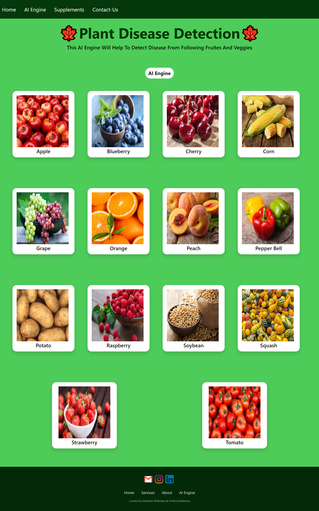
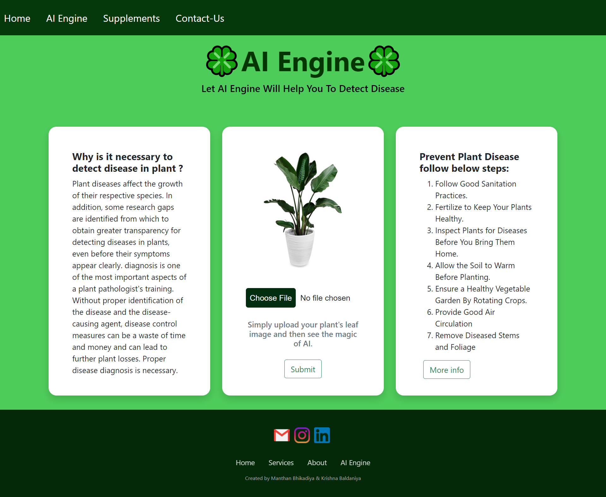
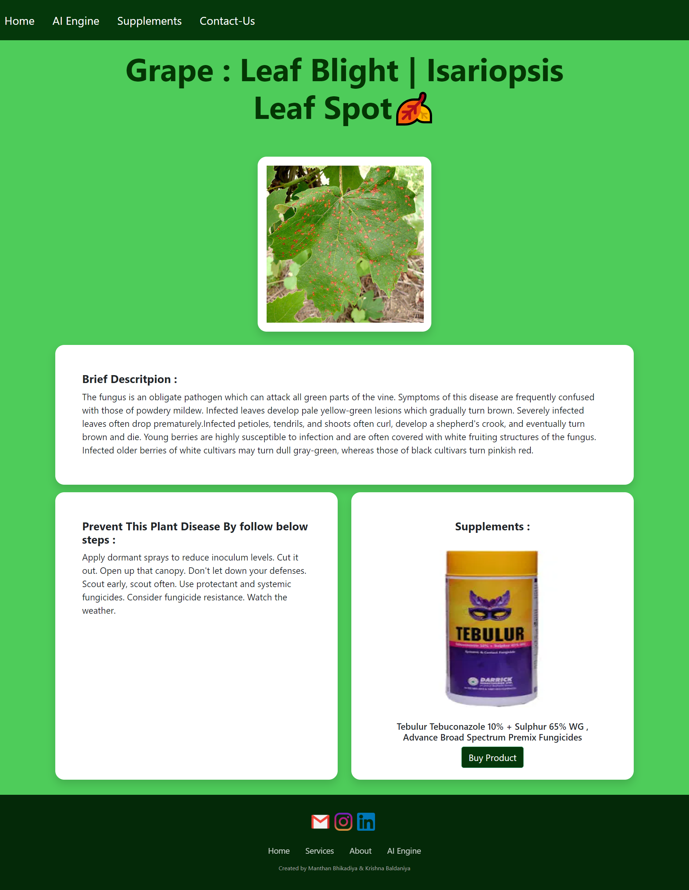
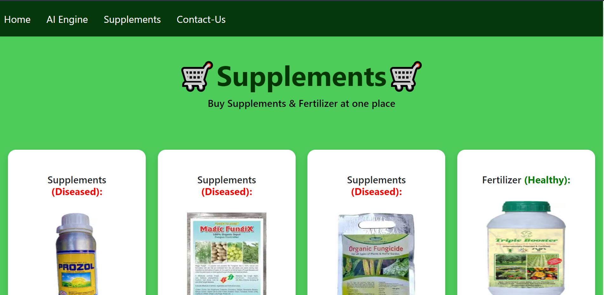

# ⭐Plant-Disease-Detection
* Plant Disease is necessary for every farmer so we are created Plant disease detection using Deep learning. In which we are using convolutional Neural Network for classifying Leaf images into 39 Different Categories. The Convolutional Neural Code build in Pytorch Framework. For Training we are using Plant village dataset. Dataset Link is in My Blog Section.

## ⭐Run Project in your Machine
* You must have python install in your machine.
* Create a Python Virtual Environment & Activate Virtual Environment [Link](https://docs.python.org/3/tutorial/venv.html)
* Install all the dependencies using below command
    `pip install -r requirements.txt`
* Go to the `Flask Deployed App` folder.
* Download the pre-trained model file `plant_disease_model_1.pt` from [here](https://drive.google.com/drive/folders/1ewJWAiduGuld_9oGSrTuLumg9y62qS6A?usp=share_link)
* Add the downloaded file in `Flask Deployed App` folder.
* Run the Flask app using below command `python3 app.py`
* You can also use downloaded file in `Model` Section and play with it using Jupyter Notebook.

## ⭐Contribution ( Open Source )
* This Project is now open source.
* All the developers who are intrested they can contribute in this project.
* Yo can make UI better , make Deep learning model more powerful , add informative markdown file in section...
* If you will change Deep learning make sure you upload updated markdown file (.md) , .pdf and .ipynb in particular section.
* Make sure your code is working. It will not have any type or error.
* You have to fork this project then make a pull request after you testing will successful.
* How to make pull request : https://opensource.com/article/19/7/create-pull-request-github

## ⭐Testing Images

* If you do not have leaf images then you can use test images located in test_images folder
* Each Image have it's disease name so you can verify model is working perfact or not.

## ⭐Blog Link
<a href="https://medium.com/analytics-vidhya/plant-disease-detection-using-convolutional-neural-networks-and-pytorch-87c00c54c88f" target = "_blank">Plant Disease Detection Using Convolutional Neural Networks with PyTorch</a> 

## ⭐Deployed App
<a href="https://plant-disease-detection-ai.herokuapp.com/" target = "_blank">Plant-Disease-Detection-AI</a> 

## ⭐Snippet of Web App :
#### Main page
  
#### AI Engine 
  
#### Results Page 
  
#### Supplements/Fertilizer  Store
  
#### Contact Us 
   
